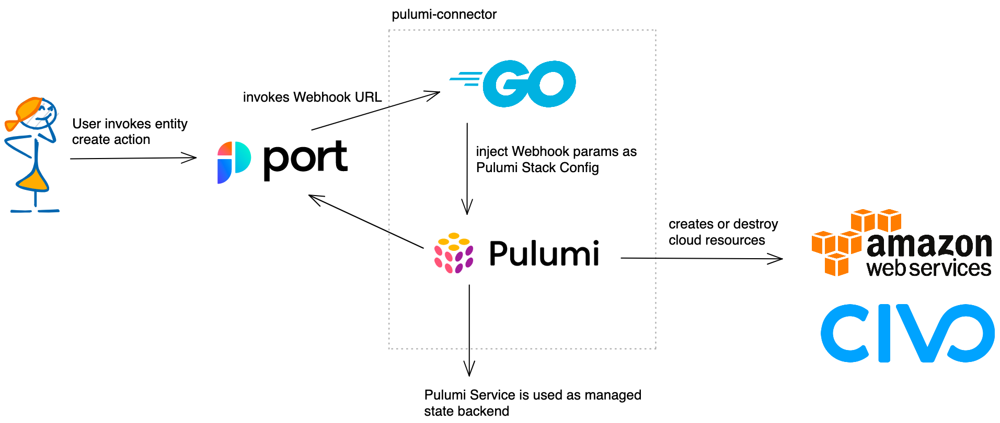

# Port Pulumi Connector

## Introduction

This repository contains the code for the Pulumi connector for Port. This connector allows you to create and manage
Pulumi stacks from Port.

It is not meant to run in production, but rather as a proof of concept and a base for any further integration from
Pulumi to Port.

## What is Port?

Port is a Developer Platform made to make life easier for developers and DevOps in an organization, by creating a single
platform that acts as a single source-of-truth for all the infrastructure assets and operations existing in the
organization's tech stack.

Port then allows engineers to perform actions on these assets in a self-service fashion. From provisioning a dev
environment, understanding who is the owner of a microservice, or any unique use case DevOps want to self-serve and
automate.

Head over to [Port](https://www.getport.io/) to learn more about the product.

## What is Pulumi?

`Pulumi` is an open-source infrastructure-as-code tool for creating, deploying and managing cloud
infrastructure. `Pulumi` works with traditional infrastructures like VMs, networks, and databases and modern
architectures, including containers, Kubernetes clusters, and serverless functions. `Pulumi` supports dozens of public,
private, and hybrid cloud service providers.

## Prerequisites

If you want to follow along with this article, you need have access to following items:

- An IDE or text editor of your choice
- Go SDK installed (1.20)
- A Port account
- A free Pulumi Account (if using the SaaS backend) and the CLI
- ngrok (if you want to test the webhook locally)
- A Civo account (if you want to test the connector)
- An AWS account (if you want to test the connector)

## Architecture Diagram



We will create a Go web server that will act as a webhook for Port. This webhook will be called by Port when a user
wants to self-service a resource. To interact with Pulumi, we will use the Pulumi Automation API.

The Pulumi Automation API is a programmatic interface for running Pulumi programs without the Pulumi CLI. Conceptually,
this can be thought of as encapsulating the functionality of the CLI (pulumi up, pulumi preview, pulumi destroy, pulumi
stack init, etc.) but with more flexibility.

In our example, we will create S3 buckets on AWS and Civo Kubernetes clusters. To state of these resources will be
stored in the Pulumi SaaS backend. So we don't need to worry about the state files and how to store them correctly.

## Getting Started

To access the web server, we need to expose it to the internet. For this, we will use [ngrok](https://ngrok.com/), you
can usy of off course any other tool with similar functionality.

Run the following command to expose the web server on port 8080:

```bash
ngrok http 8080
```

You should see something like this:

```bash
ngrok                                                                                                                                                                   (Ctrl+C to quit)

We added a plan for ngrok hobbyists @ https://ngrok.com/personal

Session Status                online
Account                       Engin Diri (Plan: Free)
Version                       3.1.1
Region                        Europe (eu)
Latency                       31ms
Web Interface                 http://127.0.0.1:4040
Forwarding                    https:/xxx.eu.ngrok.io -> http://localhost:8080

Connections                   ttl     opn     rt1     rt5     p50     p90
                              84      0       0.00    0.00    4.94    4.97
```

Note the forwarding URL, we will need it later.

Next step is to run the web server as docker container. You can either use `ko` with following command:

```bash
 ko build . --platform=linux/amd64,linux/arm64 -
```

To build the docker image and run it with following command, to run a pre-built image:

```bash
docker run \
  -e PORT_CLIENT_ID=<PORT_CLIENT_ID> \
  -e PORT_CLIENT_SECRET=<PORT_CLIENT_SECRET> \
  -e AWS_ACCESS_KEY_ID=<AWS_ACCESS_KEY_ID> \
  -e AWS_SECRET_ACCESS_KEY=<AWS_SECRET_ACCESS_KEY> \
  -e CIVO_TOKEN=<CIVO_TOKEN> \
  -e PULUMI_ACCESS_TOKEN=<PULUMI_ACCESS_TOKEN> \
  -p 8080:8080 \
  -it 

```json
{
  "identifier": "civo_cluster",
  "title": "Civo Kubernetes Cluster",
  "icon": "Cluster",
  "schema": {
    "properties": {
      "type": {
        "type": "string",
        "title": "The type of cluster to create, valid options are k3s or talos",
        "default": "k3s",
        "enum": [
          "k3s",
          "talos"
        ]
      },
      "cni": {
        "type": "string",
        "title": "The cni for the k3s to install valid options are cilium or flannel",
        "default": "flannel",
        "enum": [
          "cilium",
          "flannel"
        ]
      },
      "cluster_name": {
        "type": "string",
        "title": "Name of your cluster"
      },
      "region": {
        "type": "string",
        "title": "The Civo region to deploy to",
        "default": "LON1",
        "enum": [
          "NYC1",
          "FRA1",
          "LON1",
          "PHX1"
        ]
      },
      "kconfig": {
        "title": "The kconfig file",
        "type": "string",
        "description": "The kubeconfig file for the cluster"
      },
      "count": {
        "type": "string",
        "title": "Number of nodes in the nodepool",
        "default": "1",
        "enum": [
          "1",
          "2",
          "3"
        ]
      },
      "size": {
        "type": "string",
        "title": "Size of the nodes in the nodepool",
        "default": "g4s.kube.medium"
      }
    },
    "required": [
      "cluster_name"
    ]
  },
  "mirrorProperties": {},
  "calculationProperties": {},
  "relations": {}
}
```

```json
[
  {
    "identifier": "create_civo_cluster",
    "title": "Create Civo Cluster",
    "icon": "Cluster",
    "userInputs": {
      "properties": {
        "type": {
          "type": "string",
          "title": "The type of cluster to create, valid options are k3s or talos",
          "default": "k3s",
          "enum": [
            "k3s",
            "talos"
          ]
        },
        "cni": {
          "type": "string",
          "title": "The cni for the k3s to install valid options are cilium or flannel",
          "default": "flannel",
          "enum": [
            "cilium",
            "flannel"
          ]
        },
        "cluster_name": {
          "type": "string",
          "title": "Name of your cluster"
        },
        "region": {
          "type": "string",
          "title": "The Civo region to deploy to",
          "default": "LON1",
          "enum": [
            "NYC1",
            "FRA1",
            "LON1",
            "PHX1"
          ]
        },
        "count": {
          "type": "string",
          "title": "Number of nodes in the nodepool",
          "default": "1",
          "enum": [
            "1",
            "2",
            "3"
          ]
        },
        "size": {
          "type": "string",
          "title": "Size of the nodes in the nodepool",
          "default": "g4s.kube.medium"
        }
      },
      "required": [
        "cluster_name"
      ],
      "team": []
    },
    "invocationMethod": {
      "type": "WEBHOOK",
      "url": "https://2c28-46-5-138-101.eu.ngrok.io"
    },
    "trigger": "CREATE",
    "description": "Create a new Civo Kubernetes Cluster"
  },
  {
    "identifier": "delete_civo_cluster",
    "title": "Delete Civo Cluster",
    "icon": "Cluster",
    "userInputs": {
      "properties": {},
      "required": []
    },
    "invocationMethod": {
      "type": "WEBHOOK",
      "url": "https://2c28-46-5-138-101.eu.ngrok.io"
    },
    "trigger": "DELETE",
    "description": "Delete a Civo Kubernetes Cluster"
  }
]
```
